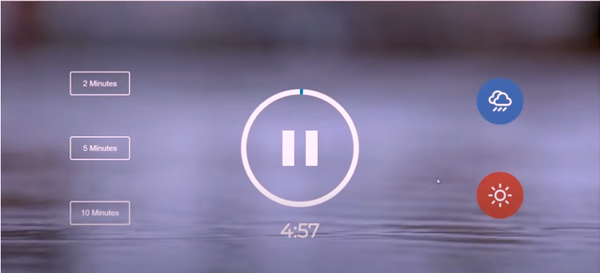

Meditation-TIMER
About
This is a Meditation-Timer with JavaScript.
・The theme of Meditation-Timer is inspired by [the following link](https://github.com/developedbyed/meditation-timer). 
・But the environment setup and coding have been created originally.



## Getting started

### 1. Build container

```
docker compose build
```

### 2. Run container

#### Foreground

```
docker compose up
```

#### Background

```
docker compose up -d
```

### 3. Install modules

```
docker compose run --rm app npm install
```

### 4. Access localhost

```
open http://localhost:8000
```

### 5. watch sass
```
cd src
npm start
```
### 6. build sass
```
cd src
npm run build
```

## Install dependencies

```
docker compose run --rm app npm install <package>@<version>
```
